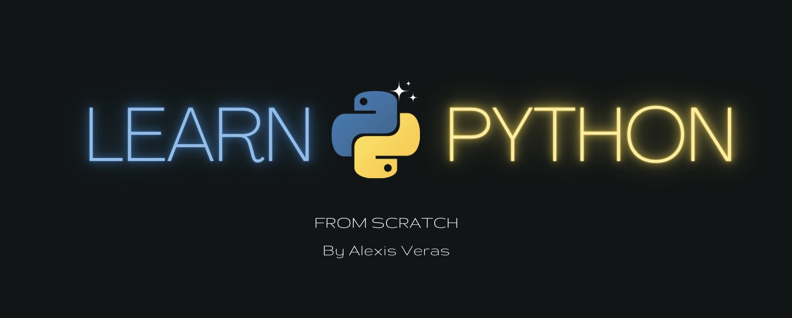

Learn Python 3
=================
by **Alexis Veras** [[About](https://github.com/Alexisveras/python/)]  
*Version 2023.03*

| Topics                  | Subtopics                                                  | Details                                   |
| :---------------------- | :--------------------------------------------------------- | :---------------------------------------- |
| 1.**Getting Started**   | What is Python                                             | Python is a general purpose..             |
|                         | History Of python                                          | Python was conceived in the late 1980s..  |
|                         | Versions of Python                                         | The lastest version of python is the 3.11 |
|                         |  - [What is Python](src/getting_started/what_is_python.md) | It’s a test                               |
| 2.**Python Data Types** | Numeric                                                    | (`Integer`, `Complex Number`, `Float`)    |
|                         | Dictionary                                                 |                                           |
|                         | Boolean                                                    |                                           |
|                         | Set                                                        |                                           |
|                         | Sequence Type                                              | (`Strings`,`List`,`Tuple`)                |
